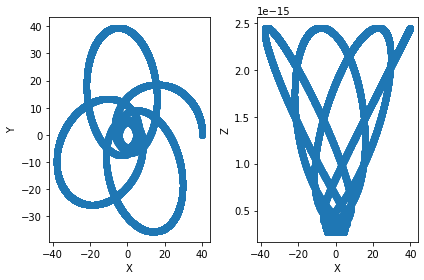
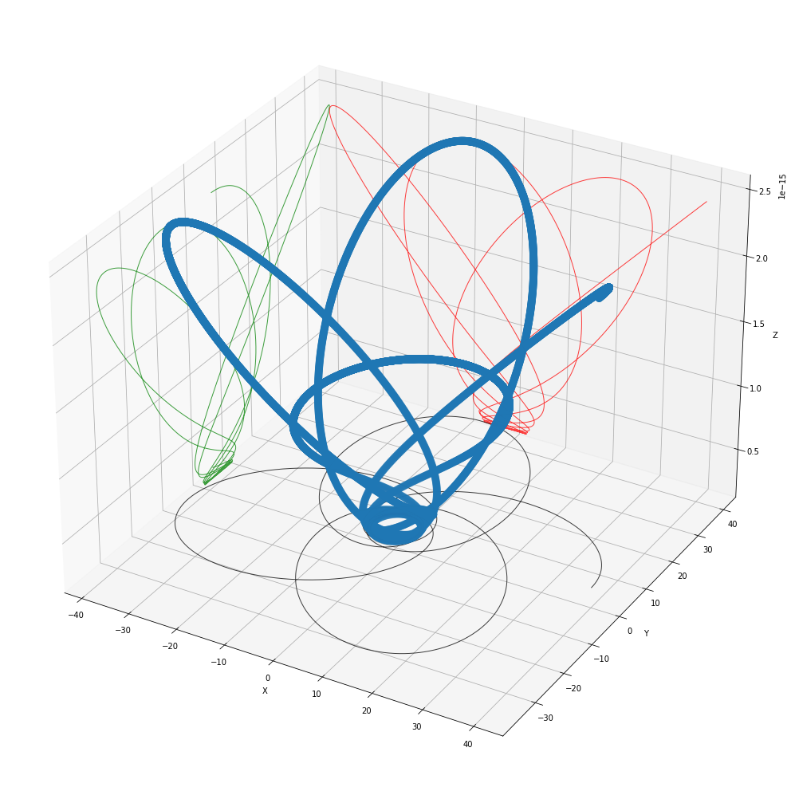
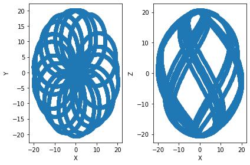
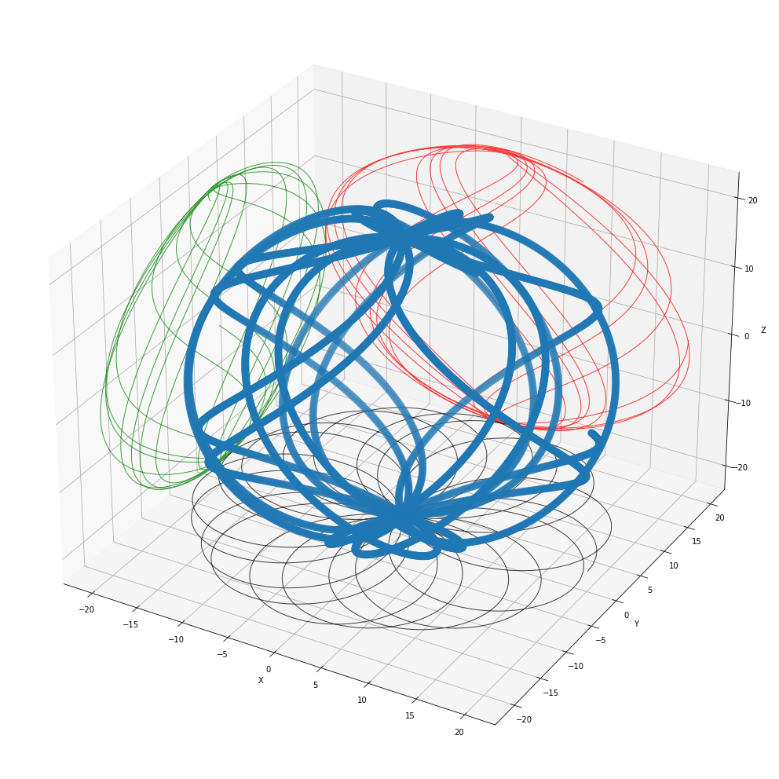

# General Relativity: Geodesics From Custom Metric (Symplectic Integration)
The project goal is simple: given a metric, through a provided line element of the general form , return the space-time trajectories under some initial conditions of postion and momentum.

The underpinning idea for solving the geodesic equations is given by the symplectic integration technique found in [1] and [2].  The geodesics seen as Hamitonian flows can be solved via a symplectic integration that seeks solutions of 4-postion and 4-momentum in an extended phase space.  

Wonderful feautres provided by the symplectic integration method:
1. The technique offers arbitary (2n+1)-order local error through the builtin 2n-order for updating each step.  
2. This symplectic integrator works for non-separable Hamiltonians through a coupling term .  
    - Thus, it can be necesary at times to tune the parameter , in order to achieve well behaved trajectories.
4. The lowest 2nd order symplectic integration technique already provides realatively low error solutions for reasonbale time scales.
5. Under ideal conditions the numerical error depends linearly on number of times steps [2].

What this package brings extra to the table:
1. The ability to define any metric.  This is done very nicely through a symbolic layer using sympy.  
    -  One defines the metric symbolically in sympy and the interface converts the symbolic equations to vector functions or numpy arrays.  
    -  Special functions libraries can easily be added such as those from scipy.special (see example `utils/symbolic_conversions.py`).  A handful of common metrics are also available under `metrics/metrics.py`.
2. Automatic solving for engery component of intial 4-momentum.  
    -  The user provides the intial 3-momentum and the time component is solved for using conservation laws.
3. Support for N test particles.  
    -  Given N intial conditions the symplectic integration algorithm is vectorized to support input of a matrix of intial position and momenta for many particles.
4. Speed.  
    -  I've done my best to keep the code base light and effieicent.  Using pure numpy operations where possible and python with minimal egregious loops. 

## Cool Plots
#### Schwarzchild M=1, order 4 with 11000 timesteps


#### Kerr M=1, a=0.5, order 4 with 6000 timesteps


#### Einstein-Rosen Wave, order 2 with 5500 timesteps
coordinates (t, rho, phi, z)
initial 4-position
q0 = [0, 10, np.pi / 4, 1]
initial 3-momentum
p0 = [0, 2, 1]
(note: mainly tesing this more complex metric, not entirely sure of good intial conditions to test with)  


## Philosophy
The philosophy behind this project is building code that is as simple as possible, so that it can be modified and adapted to suit the needs of those wanting to play around with constructing thier own geodesics from custom metrics.  In order to provide a reasonable service of such a goal the methods for computing the space time trajectories needed to already be both resource light and fairly accurate for long time intervals.  Thus, the desicion to use both a symbolic approach to python, via sympy, and a more accurate sympletic integration scheme for finding geodesics made the most sense.   The choice to incorporate more abstract elements may be a geat boon or somewhat cumbersome.  We shall see as the utility of the project is futher explored.

## Requirements
```
numpy, sympy, scipy, matplotlib
```
The project only relies on `numpy` and `sympy` for the heavily lifting, in addition to `scipy` for special functions and `matplotlib` for plotting.

## Best Way to Contribute
Reference what you use and give credit.  This project was not built in a vacuum.  It has been iterated on and the more the source material of mathematics is understood the more this project will evolve into its own.  Follow the project philosphy, and see how that is reflected in code.  This tool should only become more useful to scientists, students, or anyone wanting to learn.

We need more metrics!  See the the metrics folder and metrics.py.  One can always add thier own metric as per the goal of the project, but building up a library of metrics would be nice too.

## API

### geodesics_from_metric.geodesic_from_metric
```
geodesic_from_metric(q, dq, line_element, metric_tensor_params_sym,
                     Q0, P0, metric_tensor_params, n_timesteps,
                     delta, omega=1, order=2, timelike=True,
                     solve_p0_zeroth_term=True,
                     neg_g_inv=False)
```
```
Parameters
    ----------
    q : sympy expression
        sympy Matrix holding the coordinate variables.
    dq : sympy expression
        sympy Matrix holding the differential variables.
    line_element : sympy expression
        Expression for the line element in provided coordinates.
    metric_tensor_params_sym : sympy expression
        sympy Matrix holding the parameter varaibles used in the line element
        or metric tensor.
    Q0 : array like, shape (n_coords, N)
        Initial 4-postion matrix of the test particles. Rows are commponents
        of postions and columns are different initial positions.
    P0 : array like, shape (n_coords, N)
        Initial 4-momentum matrix of the test particles. Rows are commponents
        of momentum and columns are different initial momenta. If 3-momentum is 
        provided, the zeroth component will automatically be solved for using
        the metric.  Otherwise if a 4-momentum is provided there is an option
        to ignore the zeroth term and recalculte using the 
        ``solve_p0_zeroth_term`` boolean parameter.
    metric_tensor_params : list
        List of parameter values for the metric tensor.
    n_timesteps : int
        Number of timesteps used in computing the geodesics.
    delta : float
        Interval size for each timestep in the geodesic computations.
    omega : float, optional
        Coupling constant for Hamiltonian Flow.  This allows for non-separable
        Hamiltonians.  The default is 1.
    order : int, optional
        Order of the sympletic integration scheme. The default is 2.
    timelike : bool, optional
        Option to toggle between time-like and null-like geodesics. 
        The default is True.
    solve_p0_zeroth_term : bool, optional
        Option to toggle the automatic computation of the zeroth initial 
        4-momentum term.  Applicable when p0 provided is a list of length 4.
        The default is True.
    neg_g_inv : bool, optional
        Option to toggle the sign convention on the inverse metric tensor.
        Sometimes sympy inverse Matrix method may change the sign convention.
        The default is False

    Returns
    -------
    geod : list
        List of results for each timestep.  Each timestep will contain an
        array of shape (phase_space_dim, n_coords, N).  The phase space will
        contain (q, p, x, y) vectors.
        
        Note: Here q and x are the postions in the double
        phase space, constructed for the symplectic integration scheme, which
        has the 2-form dq ^ dp + dx ^ dy (where ^ means the wedge product
        of differential forms).
```

## Examples 

### Schwarzchild Metric
Defining a metric is both simple and easy to explore in jupyter notebook first (see example_notebooks/schwarzchild_metric.ipynb)

1) Define the variables using sympy and create the line element
```
import sympy as sym
import utils.symbolic_variables as vrs

##### Schwarzchild Metric #####
q, dq = vrs.create_variables_and_differentials(
    't, r, theta, phi',
    parameter_var_string=None
)
params_sym = vrs.create_param_variables('M')

# metric ds^2
line_element = (
    (1 - 2 * params_sym[0] / q[1]) * dq[0] ** 2 
    - (1 - 2 * params_sym[0] / q[1]) ** -1 * dq[1] ** 2 
    - q[1] ** 2 * (dq[2] ** 2 + sym.sin(q[2]) ** 2 * dq[3] ** 2)
)
```

2) Provide initial condictions and parameter values
```
# intial conditions
metric_tensor_params = [1] # M=1
### columns for N test particles (2 test particles shown here)
# initial 4-momentum
Q0 = np.array(
    [
     [0, 40, np.pi / 2, 0],
     [0, 40, np.pi / 2, 0]
     ]
).T
# initial 3-momentum
P0 = np.array(
    [
     [0, 0, 3.83405],
      [0, 0, 4.83405]
     ]
).T
```

3) Call up the geodesic_from_metric function with specified timesteps, delta, omega, etc.  The geodesic results will be a list of numpy arrays.
```
from geodesics_from_metric import geodesic_from_metric

# geodesic
n_timesteps = 5500
delta = 0.5
geod = geodesic_from_metric(
    q, 
    dq,
    line_element,
    params_sym,
    Q0, 
    Q0, 
    metric_tensor_params,
    n_timesteps,
    delta, 
    omega=1,
    order=2, 
    timelike=True,
    solve_p0_zeroth_term=True,
    neg_g_inv=False
)
```

4) Extract the equations of motion
```
# the two phase spaces should converge, so we just pick first phase space postion component
## can only choose 1 particle to plot with basic plotter
i = 0 # first test particle
eqns_motion = np.array([t[0, :, i] for t in geod])
del i
```

5) Do some coordinate transformations if necessary
```
# convert to cartesian for Schwarzchild/Kerr
a = 0 # schwarzchild
x = np.sqrt(a ** 2 + eqns_motion[:, 1] ** 2) * np.sin(eqns_motion[:, 2]) * np.cos(eqns_motion[:, 3])
y = np.sqrt(a ** 2 + eqns_motion[:, 1] ** 2) * np.sin(eqns_motion[:, 2]) * np.sin(eqns_motion[:, 3])
z = eqns_motion[:, 1]  * np.cos(eqns_motion[:, 2])
```

6) Plotting
```
import utils.basic_geodesic_plotter as bgp

bgp.geodesic_plotter_3d(x, y, z, axes_names=['X', 'Y', 'Z'])
```


#### References
Special thanks to https://github.com/GeoffCope/ for sparking this project. Also for work in finding interesting metrics and reducing them to explicit forms, which often involves solving systems of pdes!

```
[1] Christian, Pierre and Chan, Chi-Kwan;
    "FANTASY: User-Friendly Symplectic Geodesic Integrator
    for Arbitrary Metrics with Automatic Differentiation";
    `2021 ApJ 909 67 <https://doi.org/10.3847/1538-4357/abdc28>`__
[2] Tao M. Explicit symplectic approximation of
    nonseparable Hamiltonians: Algorithm and
    long time performance. Phys Rev E. 2016 Oct;94(4-1):043303.
    doi: 10.1103/PhysRevE.94.043303. Epub 2016 Oct 10. PMID: 27841574.
```
Inspired by:
The EinsteinPy Project (2021).
EinsteinPy: Python library for General Relativity
URL https://einsteinpy.org
